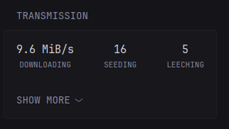

# glance-transmission

A small Glance extension that queries a Transmission RPC and returns a widget.



## Usage

Run the container and point Glance to the extension URL.

Example Glance config:

```yml
- type: extension
  url: https://${GLANCE_TRANSMISSION_URL}/transmission
  allow-potentially-dangerous-html: true
  cache: 30s
  # Transmission RPC base URL is supplied as a parameter
  parameters:
    url: "https://${TRANSMISSION_URL}/transmission/rpc"
    # optional parameters understood by the extension:
    # view: when set to 'basic' the widget will only render the top-line summary
    # mode: when set to 'upload' the summary will show DOWNLOADING, UPLOADING, SEEDING
    # Example: show only the summary and include upload column
    view: basic
    mode: upload
  headers:
    X-Transmission-Username: ${TRANSMISSION_USER}
    X-Transmission-Password: ${TRANSMISSION_PASSWORD}
```
## Installation

```yaml
services:
  glance-transmission:
    image: ghcr.io/xtrems876/glance-transmission:latest
    ports:
      - "<HOST_PORT>:8080" # replace <HOST_PORT> with the host port you want to use
```

## Acknowledgements

I based this project on several existing examples:

- I got the idea for how to communicate with Transmission from https://github.com/gethomepage/homepage/tree/dev/src/widgets/transmission
- I got the idea for how to make an extension for Glance from https://github.com/haondt/glance-github-graph
- I adapted the looks and behavior of the widget from https://github.com/glanceapp/community-widgets/blob/main/widgets/qbittorrent-stats/README.md